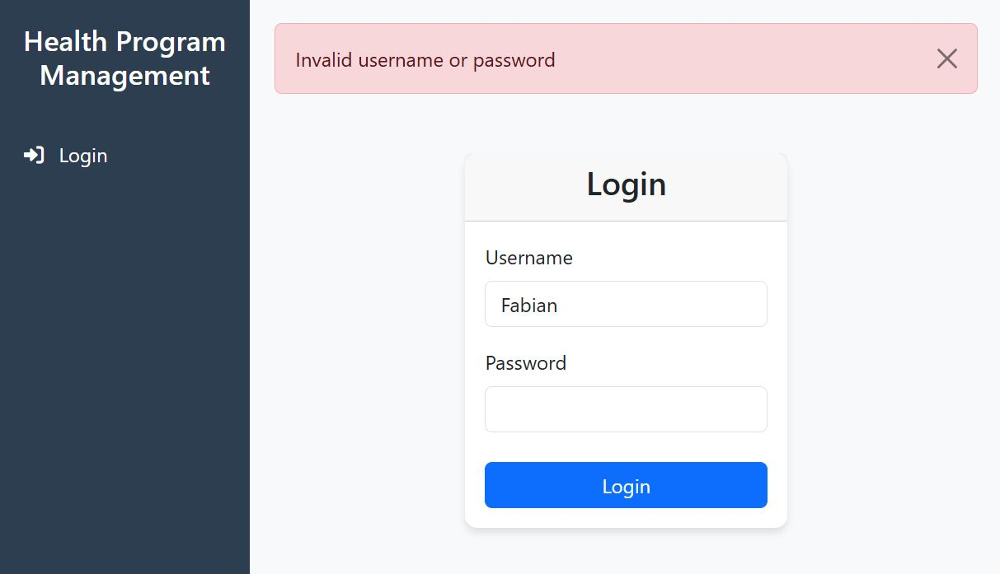
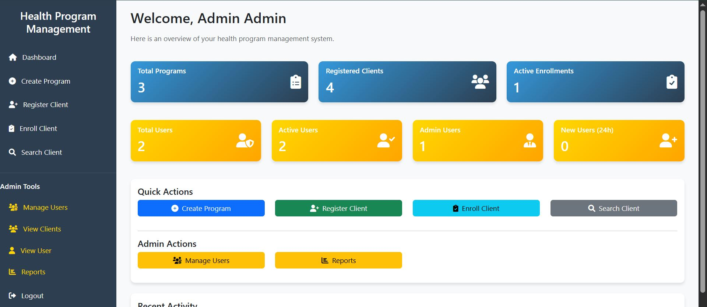
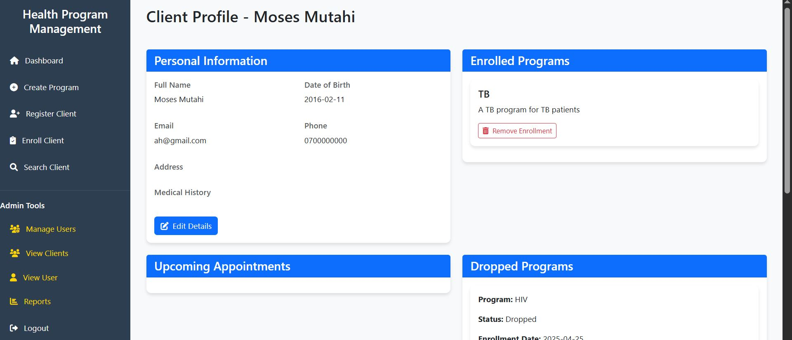
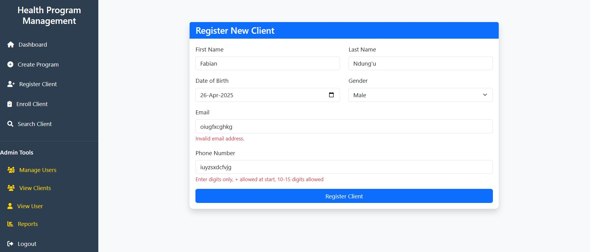
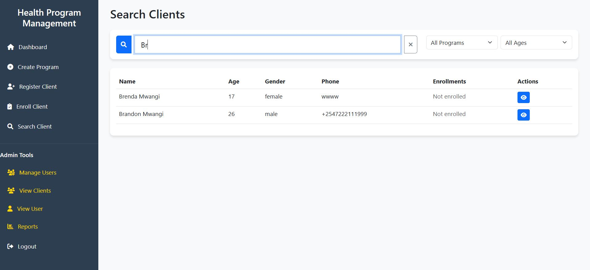

# 🏥 Health Program Management System

## Overview
A Flask-based web application built to manage health programs, clients, appointments, and notifications for clinics or health organizations. It features role-based access for admins, doctors, and clients.

Purpose:
This project is a web-based system designed to manage healthcare program enrollments, client profiles, and doctor appointments efficiently. It provides both administrative and medical staff with easy-to-use dashboards for daily operations, while also offering a controlled public API for external integrations.

Main Features:
🛠 Admin Dashboard
Manage and oversee users (doctors and other admins).

Register new healthcare programs (e.g., TB, HIV, Malaria programs).

View system-wide enrollment and appointment statistics.

🩺 Doctor Dashboard
View assigned clients and their active enrollments.

Schedule and manage client appointments.

Update appointment statuses (attended, canceled, rescheduled).

👤 Client Enrollment
Register new clients into healthcare programs.

Manage client enrollment statuses (active, dropped, completed).

🔍 Client Search
Flexible search functionality allowing quick lookup of clients by name, phone, or ID.

Access detailed client profiles with enrollment and appointment history.

🌐 Public API Access
A public API endpoint is available to retrieve client profile information.

Only authorized external websites can access the public API (controlled CORS settings).

The public API does not require user authentication but remains secure from unauthorized origins.

## Important Resources - User Logins and External Website Link
### 1. **Admin DashBoard**
- Username : **admin**
- Password: **admin123**
  
### 2. **Doctor Dashboard**
- Username : **fabian**
- password : **fabian123**
  
### 3. **Link to external authorized website to test public API**
- [External website](https://cemaexternalsite.netlify.app/)
- [Github repository](https://github.com/Fabian-lewis/cema-external-website)

## 4. **Link for the deployed app***
- [My Solution](https://cema-health-app.onrender.com)
---

## 🚀 Technologies Used

- **Flask** – Lightweight Python web framework  
- **Flask-SQLAlchemy** – ORM for SQLite database handling  
- **SQLite** – Lightweight database for fast development  
- **HTML/CSS/JavaScript** – Frontend interface  

---


## 📁 Project Structure

```
health_program/ ├── app/
|   ├── api/
│   │   ├── _init_.py – API factory
│   │   ├── routes.py – APIs endpoints
│   ├── init.py – App factory and extension setup
│   ├── models.py – SQLAlchemy models (User, Client, Program, etc.)
│   ├── routes/ – Blueprint route modules
│   ├── templates/ – HTML templates
│   │   ├── base.html – Shared layout
│   │   ├── index.html – Dashboard
│   │   ├── manage_users.html – Admin page for adding new users
│   │   ├── view_clients.html – Admin page for viewing clients
│   │   ├── create_program.html – page for creating a new program
│   │   ├── enroll_client.html – page for enrolling a client to a program
│   │   ├── register_client.html – page for registering a client 
│   │   ├── search_client.html – page to search for a user
│   │   ├── client_profile.html – page for the clients profile
│   │   ├── reports.html – page for reports
│   │   ├── edit_client.html – page for editing a client
│   │   ├── edit_program.html – page for editing a program
│   │   ├── login.html – page for login in
│   ├── static/ – CSS, JS, and images
│   ├── forms.py – WTForms for handling input
│   ├── utils.py – Helper functions (e.g., name matching, date logic)
│   └── config.py – Configuration settings
├── instance/
│   └── cients.db – SQLite database file
├── run.py – Main app entry point
├── requirements.txt – Python dependencies
├── README.md – Project documentation
├── migrations - For modifications done on the database
└── .venv – Environment variables

```


## 📌 Key Features

### 🔐 Role-Based Dashboards

#### 1. **Admin Dashboard**
- View and manage all users (doctors, clients)
- Create, edit, and delete health programs
- Monitor client enrollments
- Track and manage appointments and their statuses
- (Planned) Admin reports and analytics
- (Planned) Send notifications


#### 2. **Doctor Dashboard**
- View appointments assigned to them
- Add notes after client visits
- Monitor program enrollments and statuses for their clients
- Update appointment statuses (Scheduled, Completed, etc.)


### 📝 Other Core Pages

#### 4. **Client Registration**
- Submit personal info (name, DOB, gender, phone, email)
- Auto-create profile in system
- (Planned) Email confirmation


#### 5. **Enroll Clients**
- Search for and select a client
- Select the program to enroll the client
- Enroll user
- (If user is already enrolled in a program then he/she cannot be enrolled again)


#### 6. **Search Client**
- Search for a client from the registered list of clients
- Enter clients name or filter by age or program
- Results populate in the results table showing name, age, gender, phone, enrollments and actions
- Click on view action to access the Clients Profile


#### 7. **Clients Profile**
- Accessed by searching for the client in search page
- Displays clients information categorized in different groups (Personal information, enrolled programs, upcoming appointments, dropped programs, meta data)
- Personal Information - displays a clients personal info (name, date of birth, email etc)
- Enrolled Programs - displays programs clients have been enrolled in
- Dropped Programs - Displays programs that a user has been dropped off from
- upcoming appointments (planned) - to display booked appointments for the client


---

## 📌Admin Specific Pages

#### 1. **Manage Users Page**
- Admins can add and view all the existing users in the system
- Insert data for the new user in the new user form
- Existing user form displays existing users and delete and view actions for each user
- View action displays the user detais in view_user page
- Delete deletes user

### 2. **View Clients Page**
- Displays all the registered clients
- Add new client feature to add a new client
- View user action (on table) to view a clients profile
- Delete user action (on table) to delete a clients profile
- (planned) Edit user action (on table) to edit a clients profile
- (planned) Export to CSV - get all users in downloadable CSV file

### 3. **Reports Page**
- (Plannned) - To display metric statistics and analysis 
---


## 🧩 Core Models & Relationships

### 1. **User**
- Fields: `username`, `email`, `phone`, `password_hash`, `role`, `created_at`
- Roles: `'admin'`, `'doctor'`, `'client'`
- Relations:
  - One-to-one: `Client` (for profile)
  - One-to-many: `Appointment` (as doctor), `Notification`

### 2. **Client**
- Fields: `full_name`, `date_of_birth`, `gender`, `phone`, `email`
- Linked to `User`
- Relations:
  - Many-to-many: `Program` (via `Enrollment`)
  - One-to-many: `Appointment`

### 3. **Program**
- Fields: `name`, `description`, `start_date`, `duration`
- Linked to: `Enrollment`, `Appointment`

### 4. **Enrollment**
- Links `Client` ↔ `Program`
- Fields: `start_date`, `end_date`, `status_id`, `notes`

### 5. **Appointment**
- Links `Client` ↔ `Doctor` ↔ `Program`
- Tracks appointment date, status, and doctor notes

### 6. **Notification**
- Linked to a `User`
- Contains a message and `status_id` (read/unread)

### 7. **Status**
- Shared by: `Enrollment`, `Appointment`, `Notification`
- Represents status types (e.g., Enrolled, Completed, Read)

---

## 🧱 Database Schema Overview

```plaintext
User (1) —— (1) Client
User (1) —— (M) Notification
User (1) —— (M) Appointment [as doctor]

Client (1) —— (M) Enrollment —— (1) Program
Client (1) —— (M) Appointment —— (1) Doctor

Enrollment —— (1) Status
Notification —— (1) Status
Appointment —— (1) Status

```
---
## ✅ Current System Functionality
- Full database schema with defined relationships
- User roles and access control implemented
- User and Client registration implemented
- Clients have user accounts and personalized profiles
- Enrollment logic with duplication checks (active status only)
- Search functionality with links to client's profile

---
## 🛠️ What to Work On
  1. Add admin reports and analytics
  2. Implement email notifications
  3. Improve form validation and error messages
  4. Notifications module
  5. Appointments module - schedule and book

 ----
 ## 📷 Screenshots

### 1. **Login**


### 2. **Admin Dashboard**


### 3. **Doctor Dashboard**


### 4. **Client Profile**


### 5. **Enroll Client**


### 6. **Register Client**


### 7. **Search Clients**


---


## 🤝 Contributions & Feedback
**Feel free to fork the repo, raise issues, or suggest improvements.**

---

## 📄 License
MIT License – feel free to use and modify for personal or educational use.
---


## 👨‍💻 Author
**Fabian Ndung'u**
Aspiring software engineer with a passion for building impactful systems and solving real-world problems using code.  
- 🔗 [GitHub](https://github.com/Fabian-lewis)
- 📧 [Email](fabitolewi@gmail.com)
- 💼 Open to collaboration and new opportunities!
